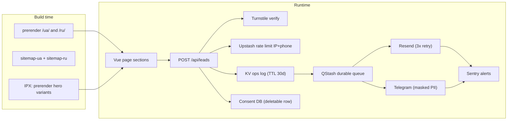
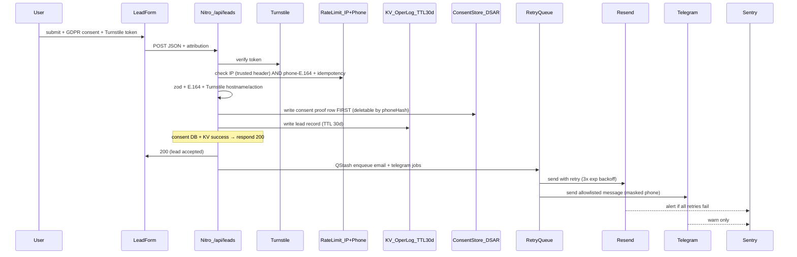

# EASY WEST — Architecture, Setup & Delivery Plan

## Sources & Constraints

- Product/design spec: [doc/ПОВНЕ ТЕХНІЧНЕ ЗАВДАННЯ ДЛЯ ДИЗАЙНУ LANDING PAGE EASY WEST.md](doc/ПОВНЕ ТЕХНІЧНЕ ЗАВДАННЯ ДЛЯ ДИЗАЙНУ LANDING PAGE EASY WEST.md) (UX, animation timings, GDPR/GTM, i18n URLs, form routing)
- Brand logos (`doc/logos/`, optimize via `assets:brand` on init):
  - [logo-square.png](doc/logos/logo-square.png) — square mark; **primary for `SiteHeader`**
  - [logo.png](doc/logos/logo.png) — square mark, higher quality; **favicon / apple-touch / `icon.png` source**
  - [logo-horizontal.png](doc/logos/logo-horizontal.png) — horizontal lockup with wordmark; footer, wide layouts, **OG default** composite
  - [logo-squre-text.png](doc/logos/logo-squre-text.png) — square + wordmark (filename typo retained); **reserved** for footer / print / future lockups (not MVP header)
- **Color scheme:** light-only semantic tokens in **§3.1** (hex in `@theme`; no dark theme / `prefers-color-scheme` variant)
- **Confirmed stack choices:** Nuxt 3.x, **Tailwind CSS v4** (Vite plugin), deploy **VPS first** (Nitro `node-server` + nginx)
- **Package manager:** `pnpm` with committed lockfile

---

## 1. Framework & Stack Selection

### Recommendation: **Nuxt 3** (not Next.js)

| Criterion | Nuxt 3 | Next.js (React) |
|-----------|--------|-----------------|
| SSR/SSG & CWV | Nitro prerender + `useSeoMeta` / `useServerSeoMeta` ([Nuxt SEO docs](https://nuxt.com/docs/3.x/getting-started/seo-meta)) | Strong, but heavier client bundles common for motion-heavy landings |
| i18n + hreflang | `@nuxtjs/i18n` v9+ with `useLocaleHead({ seo: true })` — **pin major in package.json** and verify API against installed docs before bootstrap | `next-intl` works; more manual SEO wiring |
| Animations per spec | `@vueuse/motion` + central `useReducedMotion()` in `useMotionPresets` | Framer Motion (React-only) |
| Lead API | Nitro server routes (Vercel serverless → VPS Node) | Route Handlers — equivalent |
| BEM + clean HTML | Vue SFCs + external **SCSS** with `@apply` | Same possible |

**Supporting modules (locked choices — no “or” at bootstrap)**

| Area | Choice | Notes |
|------|--------|-------|
| CSS | **Tailwind v4** via `@tailwindcss/vite` | Do **not** use `@nuxtjs/tailwindcss` (v3-oriented). Single `main.scss` entry with `@import 'tailwindcss'` + `@theme`. |
| SCSS | `sass` | Tokens = `$variables` only in `_tokens.scss`; CSS custom props emitted once in `main.scss` `@theme`. |
| Icons | `@nuxt/icon` | Collections: `lucide`, `simple-icons` only |
| i18n | `@nuxtjs/i18n` **^9.x** (pinned) | `strategy: 'prefix'`, locales `ua` + `ru`; config in `nuxt.config.ts` (single source of truth) |
| Motion | `@vueuse/motion` + `@vueuse/core` | `useReducedMotion()` gates all `v-motion` presets |
| Images | `@nuxt/image` | Provider: **ipx** (default on Nitro); document Vercel Image Optimization metering if enabled later |
| Fonts | `@nuxt/fonts` | Self-hosted **Inter** latin + **cyrillic** subsets (no Google Fonts hotlink — GDPR) |
| Forms | `vee-validate` + `zod` + **`libphonenumber-js`** | E.164 normalize client + server |
| Rate limit | **`@upstash/ratelimit`** + Upstash Redis | **Required on Vercel** — in-memory does not work across serverless instances. IP via **`x-vercel-forwarded-for`** on Vercel (re-audit header on VPS nginx); phone via stable `phoneHash` |
| Notify retry | **Upstash QStash** (or equivalent durable queue) | **Not** in-process retry — serverless cannot persist retries across invocations |
| Bot defense | **Cloudflare Turnstile** (invisible) | Verify token + **hostname** + **action** + max age; fail-closed; honeypot/Origin secondary |
| Lead ops log | **Vercel KV** | TTL ≤ 30 days; KV-write = user-facing success after consent DB write |
| Consent proof store | Vercel Postgres / Upstash hash (TBD) | Deletable row keyed by **`phoneHash`** (`PHONE_HASH_SALT` — stable, separate from `LEAD_IP_SALT`); write **before** KV |
| Security | Nitro `routeRules` headers + phased CSP | Baseline headers day one; CSP Report-Only → enforce (GTM/Turnstile/Sentry allowlist) |
| Monitoring | **`@sentry/nuxt`** | Client + Nitro; alerts on QStash retry exhaustion + daily "KV leads without notify" digest |
| Sitemap | `@nuxtjs/sitemap` **^7** (pinned with i18n v9) | Auto i18n when both modules installed; **`site.url` required**; **no** manual `server/routes/sitemap.xml.ts` |
| GTM | `@nuxt/scripts` (**required**) | `trigger: 'manual'` until consent — Consent Mode v2 implementation depends on it |
| Map | **External** `public/maps/europe.svg` | Lazy-loaded / `` or fetch — **not** inlined in prerender HTML (LCP/TBT) |
| Gallery | `photoswipe` | **`<ClientOnly>`** or dynamic import (client-only) |
| Reviews | `embla-carousel-vue` | Dynamic import if SSR warnings |
| Consent | Custom banner + GTM Consent Mode v2 | Separate from lead-form GDPR consent (see §5.4) |

### Rendering strategy



- **SSG-first** for landing + legal + accessibility routes per locale (fast TTFB on Vercel CDN)
- **Server routes:** `POST /api/leads`, `POST /api/qstash/notify` (webhook handler for retries), optional `robots.txt` via sitemap module
- **Sitemap:** generated by `@nuxtjs/sitemap` module only — **do not** add `server/routes/sitemap.xml.ts` (conflicts with module)
- **Root `/`:** handled **only** by `@nuxtjs/i18n` `detectBrowserLanguage` (`redirectOn: 'root'`, `alwaysRedirect: false`) — **no** extra manual 301 in `pages/index.vue` (avoids double redirect)
- Visible language switcher always available

---

## 2. Folder Structure

```
easy-west/
├── app.vue
├── nuxt.config.ts              # i18n, site.url, sitemap, nitro headers — single source of truth
├── scripts/
│   ├── validate-env.ts         # zod on process.env (prebuild)
│   └── generate-brand-assets.mjs  # sharp → favicon, apple-touch, og, logos
├── .github/workflows/ci.yml    # lint, build, playwright (on PR)
├── assets/
│   ├── brand-src/              # copies of doc/logos/*.png (not served)
│   └── scss/
│       ├── main.scss           # @use tokens/mixins → @import tailwindcss → @theme → @use blocks
│       ├── _tokens.scss        # SCSS $vars ONLY (no CSS output)
│       ├── _mixins.scss
│       ├── blocks/
│       └── layouts/
├── components/
│   ├── layout/
│   ├── ui/
│   │   ├── UiOverlayBase.vue   # shared focus trap, ESC, scroll lock, inert backdrop
│   │   ├── UiBottomSheet.vue
│   │   └── UiModal.vue
│   └── sections/
├── composables/
│   ├── useLeadForm.ts
│   ├── useLeadAttribution.ts   # UTM + referrer first-touch cookie
│   ├── useConsent.ts           # GTM Consent Mode
│   ├── useGtm.ts
│   ├── useContacts.ts
│   ├── useStickyBar.ts
│   └── useMotionPresets.ts     # useReducedMotion() + presets
├── i18n/locales/
│   ├── ua.json
│   └── ru.json
├── pages/
│   ├── index.vue               # i18n landing (no manual root redirect)
│   ├── privacy.vue
│   ├── cookies.vue
│   ├── terms.vue
│   └── accessibility.vue       # EAA accessibility statement (lorem until legal copy)
├── server/
│   ├── plugins/
│   │   └── 00-env.ts           # Nitro startup — parseServerEnv(process.env)
│   ├── api/
│   │   ├── leads.post.ts
│   │   └── qstash/
│   │       └── notify.post.ts  # durable retry webhook (email + Telegram)
│   ├── utils/
│   │   ├── env-schema.ts       # shared zod schema (build + runtime)
│   │   ├── env.ts              # export parseServerEnv / env singleton
│   │   ├── lead-schema.ts      # zod + phone E.164 + idempotencyKey
│   │   ├── rate-limit.ts       # Upstash
│   │   ├── lead-audit.ts       # KV append
│   │   └── notify.ts           # formatEmailLead (full PII) vs formatTelegramLead (allowlist)
│   └── routes/
│       └── robots.txt.ts       # optional if not using sitemap module robots integration
├── runbooks/
│   └── dsar.md
├── tests/
│   └── e2e/
│       ├── leads.spec.ts       # API + idempotency
│       └── sitemap.spec.ts     # hreflang + locale URLs
├── public/
│   ├── brand/                  # generated optimized PNGs (commit or CI artifact)
│   ├── og/og-default.jpg       # 1200×630 from generate-brand-assets
│   ├── favicon.ico
│   ├── apple-touch-icon.png
│   ├── fonts/                  # optional if not using @nuxt/fonts disk cache
│   ├── images/gallery/
│   └── maps/europe.svg         # external reference, lazy
└── types/
    ├── lead.ts
    └── content.ts
```

**BEM naming convention**

- Block: `hero`, `lead-form`, `segment-card`
- Element: `hero__title` (double underscore)
- Modifier: `ui-button_primary`, `bottom-sheet_open` — **project uses single underscore after block** (`block_modifier`), not classic `--`. Document in README + **stylelint** custom pattern so linters match.
- **Rule:** Vue templates use **only BEM classes** (+ `v-motion` where needed); no Tailwind utilities in markup
- **Icons:** `<UiIcon />` only; sizing via BEM on wrapper

**`UiButton` vs `UiMessengerLink`**

- `UiButton` — generic actions: submit, “Заявка”, nav CTA, open sheet (`variant: 'primary' | 'ghost'` only)
- `UiMessengerLink` — outbound messenger/phone links with channel icon + GTM event (`whatsapp` | `telegram` | `viber` | `phone`)

---

## Icons: `@nuxt/icon` + Iconify

(Unchanged intent — curated Lucide + Simple Icons; `UiIcon` wrapper with `label` for aria.)

```ts
export default defineNuxtConfig({
  modules: ['@nuxt/icon'],
  icon: {
    serverBundle: { collections: ['lucide', 'simple-icons'] },
  },
})
```

---

## 3. BEM + Tailwind v4 + SCSS Setup Guide

### 3.0 Tailwind v4 + SCSS (locked, but **validate via Phase 0 spike first**)

> **Known risk:** Sass requires every `@use` to come before any other rule. Tailwind v4 prefers `@import "tailwindcss"` early. Mixing many BEM block `@use`s after `@import 'tailwindcss'` will **fail** to compile. Run a throwaway spike in Phase 0 to confirm one of the two strategies below works on the installed Nuxt/Vite/Sass versions, then commit only the winner.

- **Use:** `@tailwindcss/vite` in `nuxt.config.ts` — **not** `@nuxtjs/tailwindcss`
- **Do not** inject Tailwind via `additionalData` (v4 + SCSS interop: utilities need `@reference` per partial if used in isolation)
- **`_tokens.scss`:** only `$ease-soft`, `$duration-*` — **no** `:root` or CSS rules (prevents duplicate emission when imported)
- **`additionalData`:** inject only `@use "~/assets/scss/tokens" as *;` and mixins — never `@import` or CSS output from tokens
- **`@reference` discipline:** avoid sprinkling `@reference "~/assets/scss/main.scss"` in every partial (slow builds, near-circular). If a partial truly needs `@apply` in isolation, prefer making it a `.css` file imported after Tailwind, not a Sass partial.

#### Strategy A (preferred) — **split entry, no `@use` ordering conflict**

```ts
export default defineNuxtConfig({
  css: [
    '~/assets/css/tailwind.css',     // pure CSS: @import 'tailwindcss' + @theme
    '~/assets/scss/main.scss',       // Sass: @use tokens, mixins, blocks
  ],
  vite: {
    plugins: [tailwindcss()],
    css: {
      preprocessorOptions: {
        scss: {
          additionalData: '@use "~/assets/scss/tokens" as *;\n@use "~/assets/scss/mixins" as *;\n',
        },
      },
    },
  },
})
```

`assets/css/tailwind.css` (loaded first, plain CSS — no Sass ordering rule applies):

```css
@import 'tailwindcss';

@theme {
  --font-sans: 'Inter', ui-sans-serif, system-ui, sans-serif;
  --radius: 0.875rem;
  --color-background: #ffffff;
  --color-surface: #f6f8fa;
  --color-foreground: #0f1216;
  --color-card: #ffffff;
  --color-card-foreground: #0f1216;
  --color-popover: #ffffff;
  --color-popover-foreground: #0f1216;
  --color-primary: #df202e;
  --color-primary-foreground: #fcfcfc;
  --color-primary-dark: #97000f;
  --color-secondary: #f1f3f7;
  --color-secondary-foreground: #181b1f;
  --color-muted: #f1f3f7;
  --color-muted-foreground: #5e646c;
  --color-accent: #fceae8;
  --color-accent-foreground: #97000f;
  --color-destructive: #e7000b;
  --color-destructive-foreground: #f8fafc;
  --color-border: #e3e5e8;
  --color-input: #e3e5e8;
  --color-ring: #df202e;
}
```

`assets/scss/main.scss` (all Sass `@use` rules can sit at the top, legally):

```scss
@use 'tokens' as tokens;
@use 'mixins';
@use 'blocks/hero';
@use 'blocks/lead-form';
// ...
```

#### Strategy B (only if A is rejected by spike) — single Sass entry via `meta.load-css`

If a single `main.scss` is required, use `@use "sass:meta"` + `meta.load-css('tailwindcss')` after the Sass `@use` block — this defers Tailwind ingestion past the Sass ordering rule. This is fragile across Sass versions; only adopt if Strategy A spike fails.

**Decision rule:** the Phase 0 spike commits a `pnpm build` log proving the chosen strategy compiles and Tailwind utilities + BEM `@apply` both work. No further architecture work proceeds until that log is committed.

### 3.1 Color scheme

**Light-only** semantic palette (no dark theme, no `color-scheme: dark` tokens, no `prefers-color-scheme` overrides). **Implement with hex** in `@theme` (§3.0); OKLCH values below are the design reference (converted with sRGB clipping). `--primary-dark` is a **darker brand red** for hover/emphasis — not a dark-mode surface.

| Token | Hex | OKLCH (reference) |
|-------|-----|-------------------|
| `--radius` | `0.875rem` (14px) | — |
| `--background` | `#ffffff` | `oklch(100% 0 0)` |
| `--surface` | `#f6f8fa` | `oklch(97.8% .003 250)` |
| `--foreground` | `#0f1216` | `oklch(18% .01 260)` |
| `--card` | `#ffffff` | `oklch(100% 0 0)` |
| `--card-foreground` | `#0f1216` | `oklch(18% .01 260)` |
| `--popover` | `#ffffff` | `oklch(100% 0 0)` |
| `--popover-foreground` | `#0f1216` | `oklch(18% .01 260)` |
| `--primary` | `#df202e` | `#df202e` (brand red; specified as hex) |
| `--primary-foreground` | `#fcfcfc` | `oklch(99% 0 0)` |
| `--primary-dark` | `#97000f` | `oklch(42% .18 25)` |
| `--secondary` | `#f1f3f7` | `oklch(96.5% .005 260)` |
| `--secondary-foreground` | `#181b1f` | `oklch(22% .01 260)` |
| `--muted` | `#f1f3f7` | `oklch(96.5% .005 260)` |
| `--muted-foreground` | `#5e646c` | `oklch(50% .015 260)` |
| `--accent` | `#fceae8` | `oklch(95% .02 25)` |
| `--accent-foreground` | `#97000f` | `oklch(42% .18 25)` |
| `--destructive` | `#e7000b` | `oklch(57.7% .245 27.325)` |
| `--destructive-foreground` | `#f8fafc` | `oklch(98.4% .003 247.858)` |
| `--border` | `#e3e5e8` | `oklch(92% .005 260)` |
| `--input` | `#e3e5e8` | `oklch(92% .005 260)` |
| `--ring` | `#df202e` | `oklch(58% .22 25)` |

**Usage notes**

- **Primary brand:** `#df202e` on buttons, links, focus rings (`--ring` matches primary in hex after conversion).
- **Darker brand red / accent text:** `#97000f` (`--primary-dark`, `--accent-foreground`) for hover states and emphasis on tinted surfaces.
- **Surface vs background:** `--surface` (`#f6f8fa`) for alternating sections; `--background` / `--card` stay white.
- **Destructive:** system red (`#e7000b`) — distinct from brand primary for form errors.
- Tailwind utilities: `bg-background`, `text-foreground`, `border-border`, `ring-ring`, `rounded-[var(--radius)]` (or map `--radius-*` steps if needed later).

### 3.2 Tokens partial (`_tokens.scss`)

```scss
$ease-soft: cubic-bezier(0.22, 1, 0.36, 1);
$duration-fast: 200ms;
$duration-base: 300ms;
$duration-enter: 600ms;
```

### 3.3 Motion + accessibility (`useMotionPresets.ts`)

- Wire **`useReducedMotion()`** from `@vueuse/core`: when true, return empty/no-op motion variants (CSS transitions also `@media (prefers-reduced-motion: reduce)` in `_mixins.scss`)
- Default: `duration: 500–600`, `ease: [0.22, 1, 0.36, 1]`
- Scroll: `visibleOnce` only (spec §39)
- Hover: 150–250ms CSS only

### 3.4 Overlay accessibility (`UiOverlayBase`)

Required for `UiBottomSheet` + `UiModal`:

- `role="dialog"` / `aria-modal="true"`, labelled by title
- **Focus trap** with **`MutationObserver`** that re-scans focusable descendants on DOM change — required because PhotoSwipe / lazy form fields mutate the trap target after open. Tab cycles inside, restore focus on close.
- `Escape` closes
- `body` scroll lock while open; **`inert`** on page content behind overlay (preferred over `aria-hidden` — also blocks pointer/AT). Use **`wicg-inert` polyfill** or feature-detect: fallback to `aria-hidden` + `pointer-events: none` on backdrop when `inert` unsupported.
- **History API:** on sheet/modal open, `history.pushState({ overlay: id })`; `popstate` closes overlay (Android back gesture) instead of navigating away.
- Mobile sheet: swipe-down to dismiss optional (spec); respect reduced motion for enter/exit
- **`LeadForm`-specific a11y:** validation errors render in a top-of-form `<div role="alert" aria-live="polite">` summary listing each invalid field as an in-page link (`#field-id`); individual inputs reference their error via `aria-describedby` + `aria-invalid`. SR users get one announcement per failed submit, not one per field.

### 3.5 Client-only libraries

- **PhotoSwipe:** wrap opener in `<ClientOnly>` or `defineAsyncComponent` — no SSR `document`
- **Embla:** dynamic import if build warns on `window`

---

## 4. SEO & i18n Strategy

### 4.1 Routing (`nuxt.config.ts` — single source of truth)

**Pin `@nuxtjs/i18n` major** and confirm `useLocaleHead` signature against installed version before copying snippets.

```ts
i18n: {
  strategy: 'prefix',
  defaultLocale: 'ua',
  baseUrl: process.env.NUXT_PUBLIC_SITE_URL, // required for canonicals
  locales: [
    { code: 'ua', language: 'uk-UA', iso: 'uk-UA', name: 'UA', file: 'ua.json' },
    { code: 'ru', language: 'ru-RU', iso: 'ru-RU', name: 'RU', file: 'ru.json' },
  ],
  langDir: 'locales',
  detectBrowserLanguage: {
    useCookie: true,
    cookieKey: 'ew_locale',
    redirectOn: 'root',
    alwaysRedirect: false,
  },
},
```

- **`/` behavior:** i18n soft-redirect to `/ua/` or `/ru/` from cookie/browser — **do not** add a second redirect in `pages/index.vue`
- **Cookie-set policy:** the `ew_locale` cookie is set **only on explicit user switch via `LocaleSwitcher`** — auto-detection on first visit picks a locale but does **not** persist it. This avoids the failure mode where a UA user lands on a `/ru/`-shared link, gets the cookie, and is permanently stuck on `/ru/`. Implement via custom plugin that suppresses i18n's automatic cookie write on detect, then `useSwitchLocalePath` writes it on click.
- **Non-prefixed paths:** any URL outside `/ua/*` and `/ru/*` (e.g. `/about`) returns 404 — no silent root-prefix rewrite for unknown paths.
- All links: `localePath()` / `switchLocalePath()` (no full reload)

### 4.2 Meta & hreflang

```vue
<script setup lang="ts">
const { t } = useI18n()
useLocaleHead({ seo: true })

useSeoMeta({
  title: t('seo.title'),
  description: t('seo.description'),
  ogTitle: t('seo.title'),
  ogDescription: t('seo.description'),
  twitterCard: 'summary_large_image',
})
</script>
```

- **Canonical + hreflang:** from `useLocaleHead` per locale
- **`x-default` → `/ua/`:** intentional — primary market is Ukraine; no EN locale. Document so future edits don’t “fix” to a picker unnecessarily.
- **JSON-LD:** `LocalBusiness` + `FAQPage` per locale

### 4.3 `/ru/` positioning (ads & optics)

- Copy positions **Russian-speaking diaspora in EU**, not RU domestic market
- Search Console / ad geo: target EU + UA; exclude RU geo in ad platforms if required by brand policy
- Legal pages localized under `/ru/*` same as `/ua/*`

### 4.4 Sitemaps & legal

**`@nuxtjs/sitemap` + `@nuxtjs/i18n` (module-only — no manual sitemap route)**

Pin `@nuxtjs/sitemap@^7` alongside `@nuxtjs/i18n@^9`. When both modules are installed, the sitemap module **auto-detects i18n** and emits locale-prefixed URLs with hreflang alternates.

```ts
export default defineNuxtConfig({
  modules: ['@nuxtjs/i18n', '@nuxtjs/sitemap'],
  site: {
    url: process.env.NUXT_PUBLIC_SITE_URL!, // absolute https:// — required
  },
  i18n: {
    strategy: 'prefix',
    defaultLocale: 'ua',
    baseUrl: process.env.NUXT_PUBLIC_SITE_URL,
    locales: [
      { code: 'ua', language: 'uk-UA', iso: 'uk-UA', file: 'ua.json' },
      { code: 'ru', language: 'ru-RU', iso: 'ru-RU', file: 'ru.json' },
    ],
  },
  sitemap: {
    exclude: ['/api/**'],
    // optional onUrl hook if x-default must explicitly point to /ua/
  },
})
```

- **Do not** add `server/routes/sitemap.xml.ts` — conflicts with the module.
- **CI assertion (Phase 5):** fetch `/sitemap.xml` (or index) on preview; assert URLs contain `/ua/` and `/ru/`; assert `hreflang` alternates for `uk-UA` and `ru-RU`; `x-default` → `/ua/` (hook if module default differs).
- **Dynamic URLs later:** `server/api/__sitemap__/urls.ts` with `_i18nTransform: true` per [nuxt-modules/sitemap i18n guide](https://github.com/nuxt-modules/sitemap/blob/main/docs/content/1.guides/3.i18n.md).
- `robots.txt` via sitemap module integration or thin Nitro route pointing at sitemap index.
- Static legal + accessibility: `/ua/privacy`, `/ru/privacy`, cookies, terms, **`/ua/accessibility`**, **`/ru/accessibility`**

### 4.5 Accessibility statement (EAA placeholder)

- **`pages/accessibility.vue`** — same i18n routing as legal pages.
- Copy in `i18n/locales/*.json` under `accessibility.*` — **lorem placeholder** until legal review; structure: commitment, WCAG 2.1 AA target, feedback contact (`accessibility@…` placeholder), `lastReviewed` date.
- Footer link alongside privacy/cookies/terms via `localePath('/accessibility')`.
- Included in sitemap automatically as a file-based route.

---

## 5. Integrations Architecture

### 5.1 Lead pipeline



**Success criteria:** **Consent DB write + KV-write = 200**. Notify is asynchronous via **QStash** (durable across serverless invocations). KV is the ops source of truth for lead payload; consent DB is the legal proof. A flaky Resend/Telegram outage does not surface as a user-facing error — it surfaces as Sentry + optional **daily digest of leads in KV with `notifyStatus: failed`** so operators can follow up manually.

**Concurrent submissions (idempotency)**

| Layer | Behavior |
|-------|----------|
| Client | `idempotencyKey` = `crypto.randomUUID()` per form mount; `isSubmitting` disables button; ignore duplicate submits until settled |
| Server | `lead:idem:{uuid}` in KV — if exists, return cached response (TTL **300s**); else proceed and cache response on success |
| Schema | `idempotencyKey: z.string().uuid()` required |
| Tests | Playwright double-click → one KV record; API same key twice → identical 200 |

**`types/lead.ts` / zod schema**

| Field | Rules |
|-------|--------|
| `idempotencyKey` | `z.string().uuid()` — dedupe accidental double-submit |
| `from`, `to` | string, min length, trim (route cities; not "full name" unless added later) |
| `phone` | `libphonenumber-js`: **accept national format** with locale default (`UA` on `/ua/`, no default on `/ru/` diaspora); **always store E.164**; show `+` in UI hint but do not require user to type it |
| `locale` | `ua` \| `ru` |
| `source` | `hero` \| `cta` \| `sticky` \| `segment` \| `modal` |
| `consentAccepted` | literal `true` |
| `consentPolicyVersion` | string e.g. `2026-05-27` |
| `consentTimestamp` | **server `receivedAt` ISO only** — client clock is ignored as proof (informational at best) |
| `turnstileToken` | required, verified server-side against Cloudflare |
| `utmSource`, `utmMedium`, `utmCampaign`, `utmContent`, `utmTerm` | optional, from `useLeadAttribution` |
| `referrer`, `landingPath` | optional first-touch |
| `website` | honeypot — must be empty |

**`server/api/leads.post.ts`**

- **Phone:** parse with `defaultCountry` from request `locale` (`ua` → `UA`); `isValidPhoneNumber`; store **E.164**. Reject only if unparseable/invalid after normalization.
- **Write order:** (1) idempotency check → (2) rate limits → (3) Turnstile → (4) zod → (5) **consent DB row** → (6) **KV ops log** → (7) respond **200** → (8) **QStash publish** notify job. If consent DB fails, return 5xx (do not return 200).
- **Rate limit (two-layer, day one):**
  - **IP layer:** Upstash sliding-window, 5 req / 15 min. On **Vercel**, IP from **`x-vercel-forwarded-for`** (trusted edge). On **VPS**, configure nginx to set `x-real-ip` and document equivalent — **re-audit in §9 migration**. Do not trust client-spoofable raw `x-forwarded-for` alone.
  - **Phone layer:** Upstash key `lead:phone:{phoneHash}` — **1 submit / 60 sec, 5 / 24 h** per phone. Primary anti-abuse boundary (IP layer is soft anti-burst only).
- **Bot defense:** Turnstile verify + **`hostname`** matches `NUXT_PUBLIC_SITE_URL` host + **`action`** matches form context + token age ≤ 5 min. **Fail-closed** on verify failure. Honeypot + Origin/Referer advisory only.
- **Notify semantics:** After 200, enqueue **`/api/qstash/notify`** via **Upstash QStash** (3 retries, exponential backoff). Handler calls `notify.ts`. Final failure → Sentry + mark KV record `notifyStatus: failed` for operator digest.
- **Telegram PII policy (`server/utils/notify.ts`):**
  - **Email (Resend):** full PII — E.164 phone, `from` → `to`, UTM, `leadId`, locale, source.
  - **Telegram (ops chat):** **allowlist only** — route, **masked phone** (`+380•••••1234` last 4), locale, source, UTM summary, `leadId` ("look up full record in email/KV"). **No** consent timestamps, **no** IP, **no** full E.164 in Telegram unless explicitly approved later (document in privacy policy).
- **Audit / retention:**
  - **KV operational log:** full payload (minus honeypot, minus raw IP) with **TTL ≤ 30 days**; include `notifyStatus`, `leadId`.
  - **Consent proof store:** deletable row `{phoneHash, consentPolicyVersion, receivedAt, locale, ipHash, leadId}` — **`phoneHash`** uses **`PHONE_HASH_SALT`** (stable, long-lived — **do not rotate** with IP salt). **`ipHash`** uses **`LEAD_IP_SALT`** (quarterly rotation OK — breaks cross-period IP correlation only).
  - **DSAR:** `pnpm run dsar:delete -- --phone +380…` hashes with `PHONE_HASH_SALT`; also support lookup by `leadId` when user cannot reproduce exact phone format.
- **Secrets (validated at boot, see §5.7):** all via `NUXT_*` / `NUXT_PUBLIC_*` — `NUXT_RESEND_API_KEY`, `NUXT_LEADS_FROM_EMAIL`, `NUXT_LEADS_TO_EMAIL`, `NUXT_TELEGRAM_BOT_TOKEN`, `NUXT_TELEGRAM_CHAT_ID`, `NUXT_UPSTASH_REDIS_REST_URL`, `NUXT_UPSTASH_REDIS_REST_TOKEN`, `NUXT_KV_REST_API_URL`, `NUXT_KV_REST_API_TOKEN`, `NUXT_CONSENT_DB_URL`, `NUXT_PHONE_HASH_SALT`, `NUXT_LEAD_IP_SALT`, `NUXT_TURNSTILE_SECRET`, `NUXT_QSTASH_TOKEN`, `NUXT_PUBLIC_TURNSTILE_SITE_KEY`, `NUXT_PUBLIC_SITE_URL`, `NUXT_SENTRY_DSN`.

### 5.2 Email deliverability

- Send from **verified domain** on Resend (not `@gmail.com`)
- **Pre-launch checklist:** SPF, DKIM, DMARC on sending domain; test with mail-tester
- Phase 4 todo: `email-domain-auth`

### 5.3 GDPR — lead form vs analytics cookies

| Concern | Implementation |
|---------|----------------|
| Lawful basis | **Consent** for processing phone + route (checkbox linked to privacy policy) |
| Proof stored | Deletable consent-store row keyed by **`phoneHash`** (`PHONE_HASH_SALT` — stable): `consentPolicyVersion`, server `receivedAt`, `locale`, `ipHash` (`LEAD_IP_SALT` — rotatable). **Not** in append-only KV. |
| Processors | Document Resend + Telegram + Cloudflare (Turnstile) + Upstash + KV provider in privacy policy; Telegram = third-country transfer — disclose explicitly |
| Retention | KV ops log: 30 days (TTL). Consent proof: 24 months in deletable DB, then erase. Email inbox: per privacy policy, with documented quarterly purge. |
| DSAR runbook | `pnpm run dsar:delete -- --phone +380...` script: hashes phone, deletes consent row + KV keys, logs operator + timestamp to a separate audit table. Documented in `/runbooks/dsar.md`. |
| KV backup | Weekly `pnpm run kv:export` to encrypted object storage (Backblaze B2 or S3) — KV is durable but not your backup. Required because consent proof = legal evidence. |
| Analytics cookies | Separate **CookieBanner** → GTM Consent Mode v2; does not block lead submit |

### 5.4 GTM + Consent Mode v2

- Defaults: `analytics_storage: denied`, `ad_storage: denied` until explicit grant
- **Banner (EU):** **“Accept all”** and **“Reject all”** with **equal visual prominence** (no dark-pattern pre-selected accept). “Manage” optional for granular toggles.
- **Cookie:** `path=/`, `SameSite=Lax`, ~12 months; **locale-agnostic** (switching `/ua/` ↔ `/ru/` does not re-prompt)
- **dataLayer events:**
  - Success: `lead_submit_success`
  - Funnel: `lead_submit_attempt`, `lead_validation_error`, `lead_submit_error`
  - Clicks: `click_phone`, `click_whatsapp`, `click_telegram`, `click_viber`
  - UX: `open_bottom_sheet`, `faq_toggle`, `scroll_depth_25/50/75`
  - i18n: **`locale_switch`** `{ from, to }` — required for ad optimization on bilingual landing
- GTM via `@nuxt/scripts` `trigger: 'manual'` → `useConsent().grantAnalytics()` / `denyAnalytics()`

### 5.5 Attribution (`useLeadAttribution.ts`)

- On mount: read `useRoute().query` for UTM params
- Persist first-touch in cookie `ew_attribution` (session or 30d)
- Hidden fields on `LeadForm`; included in API + email (full); Telegram (UTM summary only, per §5.1 allowlist)

### 5.6 Messenger deep links (`useContacts.ts`)

- Env-driven: `tel:`, `wa.me`, `t.me`, `viber://chat?number=`

### 5.7 Runtime config validation (fail-fast)

**Do not** call `useRuntimeConfig()` inside a shared zod module at import time — it is unavailable during `nuxt build` config load and will not fail the build as claimed.

**Three layers, one shared schema (`server/utils/env-schema.ts`):**

```ts
import { z } from 'zod'

export const serverEnvSchema = z.object({
  NUXT_RESEND_API_KEY: z.string().min(1),
  NUXT_LEADS_FROM_EMAIL: z.string().email(),
  NUXT_LEADS_TO_EMAIL: z.string().email(),
  NUXT_TELEGRAM_BOT_TOKEN: z.string().min(1),
  NUXT_TELEGRAM_CHAT_ID: z.string().min(1),
  NUXT_UPSTASH_REDIS_REST_URL: z.string().url(),
  NUXT_UPSTASH_REDIS_REST_TOKEN: z.string().min(1),
  NUXT_KV_REST_API_URL: z.string().url(),
  NUXT_KV_REST_API_TOKEN: z.string().min(1),
  NUXT_CONSENT_DB_URL: z.string().url(),
  NUXT_PHONE_HASH_SALT: z.string().min(32),
  NUXT_LEAD_IP_SALT: z.string().min(32),
  NUXT_TURNSTILE_SECRET: z.string().min(1),
  NUXT_QSTASH_TOKEN: z.string().min(1),
  NUXT_PUBLIC_TURNSTILE_SITE_KEY: z.string().min(1),
  NUXT_PUBLIC_SITE_URL: z.string().url(),
  NUXT_SENTRY_DSN: z.string().url(),
})

export function parseServerEnv(env: NodeJS.ProcessEnv) {
  const parsed = serverEnvSchema.parse(env)
  // staging guard: refuse prod LEADS_TO_EMAIL pattern when NODE_ENV !== production
  return parsed
}
```

| Layer | When | How |
|-------|------|-----|
| **Build** | `pnpm build` | Top of `nuxt.config.ts`: `parseServerEnv(process.env)` (skip in `NODE_ENV=test`) |
| **Prebuild script** | CI / local | `scripts/validate-env.ts` → same `parseServerEnv(process.env)` |
| **Runtime** | Nitro cold start | `server/plugins/00-env.ts` calls `parseServerEnv(process.env)` |

Declare keys in `nuxt.config.ts` `runtimeConfig` with empty defaults so `NUXT_*` overrides apply per [Nuxt runtime config docs](https://nuxt.com/docs/guide/going-further/runtime-config). Handlers import `env` from `server/utils/env.ts` after validation.

### 5.9 Security headers & CSP

**Baseline headers (day one)** via `nitro.routeRules`:

```ts
nitro: {
  routeRules: {
    '/**': {
      headers: {
        'X-Frame-Options': 'DENY',
        'X-Content-Type-Options': 'nosniff',
        'Referrer-Policy': 'strict-origin-when-cross-origin',
        'Permissions-Policy': 'camera=(), microphone=(), geolocation=()',
        'Strict-Transport-Security': 'max-age=31536000; includeSubDomains; preload',
      },
    },
  },
},
```

**CSP (phased):** deploy **`Content-Security-Policy-Report-Only`** on staging first; collect violations; then enforce in production.

Allowlist must include:
- **GTM:** `https://www.googletagmanager.com` (scripts, frames, connect)
- **Turnstile:** `https://challenges.cloudflare.com` (script, frame, connect)
- **Sentry:** `https://browser.sentry-cdn.com`, `https://*.ingest.sentry.io`

Note: GTM often requires `'unsafe-inline'` for scripts unless a strict nonce strategy is adopted site-wide. `Referrer-Policy: strict-origin-when-cross-origin` is compatible with `useLeadAttribution` first-touch capture on HTTPS.

Optional: evaluate `nuxt-security` module later if it reduces maintenance vs hand-rolled Nitro headers.

### 5.8 Staging environment

- **Vercel preview deploys** are per-PR with prod env vars *swapped* for staging: `LEADS_TO_EMAIL` → `staging-leads@…`, separate Telegram chat, separate Upstash + KV namespaces, separate Turnstile site key.
- A stable **`staging.easy-west.example`** alias points at the latest `main` build for ongoing QA.
- No staging path uses real customer recipients — enforced by env-validation refusing the production email pattern in non-prod.

---

## 6. Component Breakdown

| Component | Props | Notes |
|-----------|-------|-------|
| `UiIcon` | `name`, `label?` | Iconify id; BEM size class |
| `UiButton` | `variant: 'primary' \| 'ghost'`, `type?`, `loading?`, `disabled?` | Form submit & in-page actions only |
| `UiMessengerLink` | `channel`, `label?` | External messenger/phone + GTM |
| `UiInput` | `modelValue`, `label`, `name`, `type`, `error?`, `autocomplete?` | **16px+** font on mobile (iOS zoom) |
| `UiBottomSheet` | `modelValue`, `title?` | Uses `UiOverlayBase`; `<md` |
| `UiModal` | `modelValue`, `title` | Uses `UiOverlayBase`; `md+` |
| `UiAccordion` | `items`, `single?` | 200–300ms height transition |
| `LeadForm` | `source` | from, to, phone, GDPR consent, `idempotencyKey`, hidden UTM/honeypot; submit lock while `isSubmitting` |
| `SiteHeader` | — | `logo-square` (from `public/brand/logo-square.png`), nav, `LocaleSwitcher` |
| `StickyMobileBar` | — | after hero; compact on scroll down |
| `EuropeMap` | `routes` | **lazy** `europe.svg`; stroke draw-on-scroll |
| `GalleryGrid` | `images` | PhotoSwipe in `<ClientOnly>` |
| `ReviewsCarousel` | `slides` | Embla; no autoplay |
| `CookieBanner` | — | analytics only; wires Consent Mode |

**Shared types (`types/content.ts`)**

```ts
export interface Step {
  id: string
  title: string
  description: string
  icon?: string
  /** contract/payment steps per spec §42 */
  kind?: 'default' | 'contract' | 'payment'
}

export interface Segment { /* ... */ }
export interface FaqItem { /* ... */ }
export interface GalleryImage {
  src: string
  width: number
  height: number
  alt: string
  placeholder?: string // LQIP or blur hash
}
```

---

## 7. Section Implementation Notes

| Section | Key behavior |
|---------|----------------|
| Hero | Split layout; 3 fields; benefits; stagger 80–120ms; **LCP image** `fetchpriority="high"` + preload |
| Segments | 6 cards; sheet `<md`, modal `md+` |
| Timeline | 9 steps incl. `kind: 'contract' \| 'payment'`; IO-driven active step |
| Geography | **Lazy** SVG; `stroke-dashoffset` reveal; no tracking UI |
| Gallery | `@nuxt/image` srcset; lazy below fold; hover 1.03; PhotoSwipe fade |
| Reviews | Embla swipe only |
| FAQ | 8+ incl. “ВАЖЛИВО ПЕРЕД ВІДПРАВКОЮ” |
| Sticky bar | Phone, messengers, “Заявка”; **one-time** subtle CTA pulse on first scroll-stop — not looping (WCAG 2.2.2); **auto-hide on `focusin` of any input** + when `visualViewport.height` shrinks ≥150px (virtual keyboard) — prevents WCAG 2.4.11 (focus obscured) on mobile |
| Footer | 3-column; legal + **accessibility** links |

**Brand asset pipeline (`scripts/generate-brand-assets.mjs`)**

Source PNGs in [`doc/logos/`](doc/logos/) copied to `assets/brand-src/` (not served). **`pnpm assets:brand`** (sharp) generates committed outputs:

| Source (`doc/logos/`) | Role | Generated output |
|-----------------------|------|------------------|
| `logo-square.png` | Header, compact UI | `public/brand/logo-square.png` (max height ~40–48px @2x, WebP optional) |
| `logo.png` | Highest-quality square | `public/brand/icon.png` (512), `public/favicon.ico` (16+32), `public/apple-touch-icon.png` (180) |
| `logo-horizontal.png` | Wide lockup + wordmark | `public/brand/logo-horizontal.png` (max width 320, optimized); composite base for OG |
| `logo-squre-text.png` | Square + wordmark (later) | `public/brand/logo-square-text.png` (copy/optimize only; wire in footer when copy-ready) |
| `logo-horizontal.png` | Social preview | `public/og/og-default.jpg` (1200×630, q≈85, centered on brand safe area) |

Wire in `package.json`: `"prebuild": "pnpm assets:brand && tsx scripts/validate-env.ts"`. `app.head` links favicon + apple-touch-icon. `SiteHeader` uses `logo-square`; footer may use `logo-horizontal` or `logo-square-text` once layout is set. Per-locale `useSeoMeta({ ogImage })` → `${siteUrl}/og/og-default.jpg` (locale-specific OG art optional later).

**Typography & images**

- **Inter:** `@nuxt/fonts`, self-hosted, **latin + cyrillic** with **explicit Ukrainian glyph subset** (`ґ Ґ є Є ї Ї ʼ` apostrophe — generic "cyrillic" subsets routinely omit these). Verify via `glyphhanger` against a UA copy sample in CI.
- **`font-display: swap`**, preload critical weights (400, 600) only.
- **Hero LCP:** explicit `sizes` / widths via `@nuxt/image`; WebP/AVIF; **prerendered variants** (`@nuxt/image` `densities` set, IPX prerender hooks) so no cold-start transform on first visitor.
- **Gallery:** lazy + placeholders (LQIP / blurhash); cap dimensions in `public/images/gallery/`.
- **Performance budgets (lighthouse-ci):** targets LCP < 2.5s, CLS < 0.1, TBT < 300ms — **warn-only first sprint**, switch to **block** after baseline captured on preview deploy. Bundle JS < 180 KB gzip per route (size-limit) — measure early; may need adjustment given Sentry + motion + carousel.
- **`europe.svg` budget:** ≤ **80 KB gzipped** after SVGO pass; CI fails if exceeded.

---

## 8. Development Roadmap (phased)

### Phase 0 — Repo bootstrap + spike (**2–3 days**)
- **Tailwind v4 + SCSS spike** — prove §3.0 Strategy A compiles end-to-end; commit `spike-build.log` before other work
- `pnpm dlx nuxi@latest init` + lockfile
- Modules: Tailwind v4 vite plugin, `@nuxtjs/i18n@^9`, `@nuxtjs/sitemap@^7`, `sass`, `@nuxt/icon`, `@vueuse/motion`, `@nuxt/image`, `@nuxt/fonts`, `@nuxt/scripts`, `@sentry/nuxt`
- `site.url` + i18n `baseUrl`; **no** manual sitemap route
- `nitro.preset: 'node-server'`; **baseline security headers** in `routeRules`; Dockerfile + nginx example
- `.env.example` with all `NUXT_*` keys incl. `PHONE_HASH_SALT`, `LEAD_IP_SALT`, QStash
- **`env-schema.ts`** + `validate-env.ts` + `nuxt.config` parse + `server/plugins/00-env.ts`
- `scripts/generate-brand-assets.mjs` + first run → `public/brand/`, favicon, OG
- stylelint BEM rule committed
- CI skeleton: lint + `vue-tsc` + prebuild + build (lighthouse/Playwright can land end of Phase 0 or Phase 5)
- Renovate config

### Phase 1 — Foundation (1–2 days)
- `main.scss` correct order; tokens/mixins discipline
- Layout shell + i18n JSON skeleton
- `useLocaleHead` + legal pages + **`accessibility.vue`** (lorem i18n strings)
- Self-hosted Inter cyrillic
- Footer links incl. accessibility; verify sitemap lists legal + accessibility URLs on preview

### Phase 2 — Core UI (1–2 days)
- Primitives + `UiOverlayBase` a11y (inert polyfill, `popstate` back-to-close)
- `useMotionPresets` + reduced motion
- `LeadForm` + locale-aware phone + `idempotencyKey` + submit lock; stub API
- `useLeadAttribution`
- Cookie banner with Accept / Reject all parity

### Phase 3 — Sections (3–4 days)
- All 8 sections; lazy map; ClientOnly gallery/carousel
- Sticky bar (one-time pulse)

### Phase 4 — Backend & tracking (2–3 days)
- `leads.post.ts` full hardening:
  - Idempotency KV dedupe + client submit lock
  - Rate limit: trusted IP header + per-phoneHash
  - Turnstile: hostname + action + token age
  - Consent DB **then** KV; both required for 200
  - **QStash** durable notify + `api/qstash/notify.post.ts`
  - Telegram allowlist / masked phone; email full PII
  - `notifyStatus` on KV + operator digest for failures
- CSP Report-Only on staging → review → enforce on prod
- Resend domain auth checklist (SPF/DKIM/DMARC)
- DSAR delete script + `/runbooks/dsar.md` (phoneHash + leadId lookup)
- KV weekly export job to encrypted object storage
- GTM + `locale_switch` + full dataLayer funnel
- Sentry + QStash failure alerts

### Phase 5 — SEO, perf, QA (2 days)
- Prerender locales + legal + accessibility
- Sitemap CI: hreflang + `/ua/`/`/ru/` URLs; JSON-LD
- Lighthouse-CI: warn → block after baseline; hero LCP prerender via IPX
- **Playwright:** happy path, **double-submit idempotency**, honeypot, Turnstile-fail, IP 429, phone 429, KV+consent success, **sitemap hreflang**, axe (landing + sheet + form errors + accessibility page)
- Real device: sticky bar keyboard hide, overlay back gesture, locale cookie policy, cookie banner reject-all

### Phase 6 — Deploy (1 day)
- Vercel prod + dedicated `staging.easy-west.example` alias
- Env vars for both environments (validated by zod at boot)
- Preview QA (form + consent + GTM + Turnstile)
- Search Console both locales
- Document VPS migration (§9)
- Verify KV export job ran at least once before go-live

**Total estimate:** ~14–19 dev days (adds: idempotency, QStash, env build validation, CSP, brand script, accessibility page, sitemap-i18n CI, Telegram PII split, trusted IP header). Single-developer estimate; excludes copywriting, design polish, and content asset production.

---

## 9. Vercel → VPS Migration Checklist

| Item | Vercel | VPS |
|------|--------|-----|
| Nitro preset | `vercel` | `node-server` |
| Env vars | Vercel dashboard | `.env` + secrets manager |
| Rate limit / KV | Upstash (same URLs) | Same Upstash or self-hosted Redis |
| Static assets | CDN | nginx `alias` or object storage |
| API routes | Serverless | Node process |
| Domain / SSL | Vercel | certbot / Cloudflare |
| Monitoring | Sentry + Vercel logs | Sentry + file/journald |

**Before claiming “no code rewrite”:** audit for Vercel-only APIs (`@vercel/kv` import style, edge runtime flags, `@vercel/og`). Prefer **Upstash SDK** for portability. Re-test rate limit + KV on VPS staging. **Re-audit client IP header** — replace `x-vercel-forwarded-for` with nginx `x-real-ip` (or equivalent trusted chain).

---

## 10. Testing & CI

| Layer | Tool | Scope |
|-------|------|--------|
| Lint | stylelint (BEM single-underscore) + eslint | block PR on violations |
| Type | `vue-tsc --noEmit` | block PR on type errors |
| Build | `pnpm build` | Nuxt + Nitro vercel preset |
| Security | `pnpm audit --prod` + Renovate config | block on high/critical, weekly auto-PRs |
| Bundle budget | `size-limit` | JS < 180 KB gzip per route — block on regression |
| Perf budget | `lighthouse-ci` against preview deploy | LCP < 2.5s, CLS < 0.1, TBT < 300ms — block on regression |
| Asset budget | custom step | `europe.svg` ≤ 80 KB gzip after SVGO |
| E2E | Playwright | leads API 200 (consent+KV), validation 400, honeypot 400, Turnstile 403, IP/phone 429, **idempotency double-submit**, form happy path, **sitemap hreflang** |
| A11y | `@axe-core/playwright` | landing + bottom sheet + form errors + **accessibility page** |
| Glyphs | `glyphhanger` | confirm UA-specific glyphs (`ґ є ї ʼ`) present in shipped Inter subset |
| Env | `validate-env.ts` in prebuild | same zod as Nitro plugin |
| Brand | `assets:brand` in prebuild | favicon + OG exist |
| Optional | Vitest + `@nuxt/test-utils` | `lead-schema.ts`, idempotency, `parseServerEnv`, phoneHash vs ipHash salts, `formatTelegramLead` allowlist |

---

## 11. Open Items (post-plan)

- Telegram bot token + chat ID + email recipient (prod and staging)
- Final gallery/review assets
- GTM container ID + tag map (GA4, Ads, Meta)
- Privacy policy text: retention (30d KV / 24mo consent DB), Turnstile, Telegram **masked** ops messages + third-country transfer, QStash processor, DSAR contact
- Ad geo policy for `/ru/` locale
- Cloudflare Turnstile site + secret keys (staging + prod hostnames)
- Consent DB choice: Vercel Postgres vs Upstash hash vs SQLite-on-VPS (decide before Phase 4)
- QStash signing secret + webhook URL for notify handler
- Backup destination + credentials for KV export job
- Accessibility statement legal copy (replace lorem)
- CSP violation review owner before enforcing in prod
- On-call owner for Sentry + notify-failure digest
- Optional Phase-7: EN locale for diaspora ad targeting
- Owner + cadence for **`LEAD_IP_SALT`** rotation only (quarterly) — **`PHONE_HASH_SALT` must not rotate** without re-hash migration plan

---

## 12. Architecture review — mitigations incorporated

| Review finding | Mitigation in plan |
|----------------|-------------------|
| In-process retry queue lost on serverless | **Upstash QStash** + webhook handler |
| `useRuntimeConfig()` does not fail build | **`parseServerEnv(process.env)`** in config + prebuild + Nitro plugin |
| Manual sitemap route conflicts with module | **Removed**; `@nuxtjs/sitemap` + `site.url` + CI hreflang tests |
| Concurrent double-submit | **`idempotencyKey`** + KV dedupe + client lock |
| Telegram full PII | **Allowlist** + masked phone; full PII email-only |
| Consent DB after KV / lost proof | **Consent DB write before KV** |
| Spoofable XFF | **`x-vercel-forwarded-for`** on Vercel; VPS re-audit |
| Phone `+` only hurts UA conversion | **Locale defaultCountry**; store E.164 |
| `phoneHash` vs `ipHash` salt conflation | **`PHONE_HASH_SALT`** stable; **`LEAD_IP_SALT`** rotatable |
| No CSP / security headers | **§5.9** baseline + phased CSP |
| No accessibility statement | **§4.5** + `accessibility.vue` lorem |
| Brand PNG ad-hoc | **`generate-brand-assets.mjs`** + prebuild |
| Cookie banner dark pattern | **Reject all** equal prominence |
| Missing `locale_switch` analytics | **dataLayer event** in §5.4 |
| Notify success but ops never notified | **`notifyStatus`** + operator digest |
| Overlay back button navigates away | **`history.pushState` / `popstate`** |
| Phase 0 underestimated | **2–3 days** |
