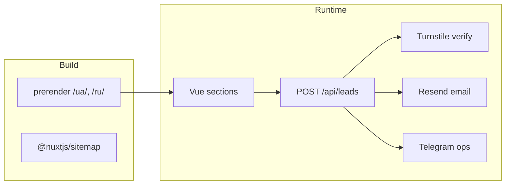
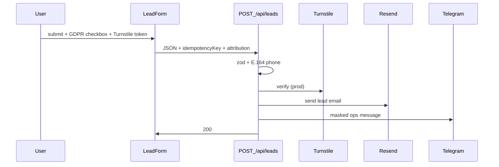

# EASY WEST — Architecture & Delivery Plan

> **Stack status (2026-05):** Simplified from the original spec. Removed for now: Upstash Redis/KV, QStash, external consent DB, hash salts, Sentry, `wicg-inert`, `@tailwindcss/vite`. See git history / PR notes for rationale.

## Sources

- Product spec: [doc/ПОВНЕ ТЕХНІЧНЕ ЗАВДАННЯ ДЛЯ ДИЗАЙНУ LANDING PAGE EASY WEST.md](doc/ПОВНЕ ТЕХНІЧНЕ ЗАВДАННЯ ДЛЯ ДИЗАЙНУ LANDING PAGE EASY WEST.md)
- Brand: `doc/logos/` → `pnpm assets:brand` → `public/brand/`, favicon, OG
- **Deploy:** VPS-first — Nitro `node-server` + nginx ([runbooks/deploy-vps.md](runbooks/deploy-vps.md))
- **Package manager:** pnpm, Node ≥24

---

## 1. Stack (current)

| Area | Choice | Notes |
|------|--------|-------|
| Framework | Nuxt 3 + Vue 3 + TypeScript | |
| CSS | Tailwind v4 + SCSS BEM | `@tailwindcss/postcss` in `nuxt.config.ts`; split `assets/css/tailwind.css` + `assets/scss/main.scss` |
| i18n | `@nuxtjs/i18n` v9 | `strategy: 'prefix'`, `ua` + `ru` |
| Sitemap | `@nuxtjs/sitemap` v7 | `site.url` required; no manual `server/routes/sitemap.xml.ts` |
| Icons | `@nuxt/icon` | `lucide`, `simple-icons` |
| Motion | `@vueuse/motion` + `@vueuse/core` | `useMotionPresets` + `usePreferredReducedMotion` |
| Images | `@nuxt/image` | IPX default |
| Fonts | `@nuxt/fonts` + `@fontsource/inter` | Self-hosted; `scripts/sync-fonts.mjs` |
| Forms | `vee-validate` + `zod` + `libphonenumber-js` | |
| Analytics | `@nuxt/scripts` + GTM | `trigger: 'manual'` until consent |
| Bot defense | Cloudflare Turnstile | Planned server verify; widget + env keys |
| Lead notify | Resend + Telegram Bot API | Env keys required; not fully wired in API yet |
| Gallery / reviews | `photoswipe`, `embla-carousel-vue` | ClientOnly / dynamic import |

**Explicitly not in scope (v1):**

- Upstash Redis rate limiting, KV lead log, QStash retry queue
- External consent proof database + `PHONE_HASH_SALT` / `LEAD_IP_SALT`
- `@sentry/nuxt` — use nginx/PM2 logs until needed

---

## 2. Runtime diagram



- **Prerender:** `/ua/**`, `/ru/**` static pages (landing, legal, accessibility)
- **Dynamic:** `/api/**` only
- **Idempotency today:** in-process `Map` in `leads.post.ts` (fine for single Nitro worker; replace with Redis/file if you scale horizontally)

---

## 3. Folder structure (actual)

```
easy-west/
├── nuxt.config.ts
├── scripts/
│   ├── validate-env.ts
│   ├── generate-brand-assets.mjs
│   └── sync-fonts.mjs
├── assets/css/tailwind.css      # @import tailwindcss + @theme
├── assets/scss/main.scss        # BEM blocks
├── components/                  # layout/, ui/, sections/
├── composables/                 # useLeadForm, useConsent, useGtm, useMotionPresets, …
├── i18n/locales/ua.json, ru.json
├── pages/                       # index, privacy, cookies, terms, accessibility
├── server/
│   ├── plugins/00-env.ts
│   ├── api/leads.post.ts
│   └── utils/env-schema.ts, env.ts
├── plugins/gtm.client.ts
└── public/brand/, fonts/, maps/, images/
```

**BEM:** `block__element`, modifier `block_modifier` (single underscore). Templates use BEM classes only (+ `v-motion` where needed).

**Overlays:** native `inert` on `.site` with `aria-hidden` fallback (`useOverlayInert`) — no `wicg-inert` polyfill.

---

## 4. Tailwind + SCSS

- **Strategy A (locked):** `css: ['~/assets/css/tailwind.css', '~/assets/scss/main.scss']`
- **Postcss:** `@tailwindcss/postcss` in `vite.css.postcss.plugins` — not `@tailwindcss/vite`
- **`_tokens.scss`:** SCSS variables only; colors in `@theme` inside `tailwind.css`
- **stylelint:** BEM single-underscore pattern

---

## 5. SEO & i18n

- Locales: `/ua/`, `/ru/`; `defaultLocale: 'ua'`
- `detectBrowserLanguage.useCookie: false` — cookie set only on explicit `LocaleSwitcher` click
- `useLocaleHead({ seo: true })` + `useSeoMeta` per page
- `x-default` → `/ua/` (primary market)
- Sitemap: module auto-integrates with i18n when both installed
- CI: `pnpm verify:sitemap` / `verify:prerender`

---

## 6. Lead pipeline (simplified)

### Request flow



### Schema highlights (`shared/lead-schema.ts`)

| Field | Notes |
|-------|--------|
| `idempotencyKey` | UUID; server dedupes in memory |
| `phone` | National input per locale → E.164 |
| `consentAccepted` | must be `true` |
| `consentPolicyVersion` | e.g. `2026-05-27` (in payload, not external DB) |
| `turnstileToken` | required; prod rejects `stub-*` tokens |
| `website` | honeypot, empty |

### Phase 4 implementation checklist

1. Turnstile server verify (hostname, action, token age)
2. Resend: email to `NUXT_LEADS_TO_EMAIL` with full lead fields
3. Telegram: allowlisted fields only (masked phone, route, source, `leadId`)
4. Keep or upgrade idempotency if running multiple Node workers

### GDPR (pragmatic v1)

| Topic | Approach |
|-------|----------|
| Lawful basis | Consent checkbox + privacy policy link |
| Proof | `consentPolicyVersion` + server `receivedAt` in email/logs |
| Processors | Disclose Resend, Telegram, Cloudflare Turnstile in privacy policy |
| Analytics cookies | Separate `CookieBanner` + GTM Consent Mode v2 |

---

## 7. Environment variables

Validated at build + Nitro boot (`server/utils/env-schema.ts`):

| Variable | Purpose |
|----------|---------|
| `NUXT_PUBLIC_SITE_URL` | Canonical / sitemap |
| `NUXT_PUBLIC_TURNSTILE_SITE_KEY` | Turnstile widget |
| `NUXT_PUBLIC_GTM_ID` | Optional |
| `NUXT_PUBLIC_CONTACT_*` | Messenger / phone links |
| `NUXT_DEPLOY_ENV` | `staging` \| `production` |
| `NUXT_RESEND_API_KEY` | Email API |
| `NUXT_LEADS_FROM_EMAIL` / `NUXT_LEADS_TO_EMAIL` | Sender / recipient |
| `NUXT_PROD_LEADS_TO_EMAIL` | Staging guard vs prod inbox |
| `NUXT_TELEGRAM_BOT_TOKEN` / `NUXT_TELEGRAM_CHAT_ID` | Ops notifications |
| `NUXT_TURNSTILE_SECRET` | Server-side Turnstile verify |

See [.env.example](.env.example).

**Validation layers:** `nuxt.config.ts` top-level `parseServerEnv`, `scripts/validate-env.ts` (prebuild), `server/plugins/00-env.ts`.

---

## 8. Security

**Headers (live):** `X-Frame-Options`, `X-Content-Type-Options`, `Referrer-Policy`, `Permissions-Policy`, `HSTS` via `routeRules`.

**CSP (phased):** Report-Only on staging → enforce in prod. Allowlist:

- GTM: `googletagmanager.com`
- Turnstile: `challenges.cloudflare.com`

---

## 9. GTM & attribution

- `@nuxt/scripts` with `trigger: 'manual'` until `useConsent().grantAnalytics()`
- Banner: Accept all / Reject all equal prominence
- Events: `lead_submit_*`, messenger clicks, `locale_switch`, scroll depth (see composables)
- `useLeadAttribution`: UTM + referrer cookie → hidden form fields

---

## 10. Roadmap

| Phase | Status | Focus |
|-------|--------|--------|
| 0–3 | Done | Bootstrap, UI, sections, GTM, fonts, a11y page |
| 4 | **Next** | Turnstile + Resend + Telegram in `leads.post.ts` |
| 5 | Pending | Sitemap CI, Playwright, Lighthouse budgets |
| 6 | Pending | VPS production deploy, Resend domain auth |

**Removed / deferred todos:** `kv-retention`, `error-monitoring` (Sentry), Upstash rate limits, QStash notify queue, DSAR script tied to external consent DB.

---

## 11. VPS deploy

- Build: `pnpm build` → `.output/server/index.mjs`
- Run behind nginx ([deploy/nginx.conf.example](deploy/nginx.conf.example))
- `NUXT_DEPLOY_ENV=production` + real Turnstile keys for prod
- Logs: journald / PM2 — no Sentry required for v1

---

## 12. Testing & CI (target)

| Check | Tool |
|-------|------|
| Lint | eslint + stylelint |
| Types | `vue-tsc` |
| Env | `validate-env.ts` in prebuild |
| Build | `nuxt build` |
| E2E | Playwright — form happy path, idempotency double-submit, Turnstile 403, sitemap hreflang |
| A11y | axe on landing + overlays |

---

## 13. Open items

- Wire Turnstile widget on `LeadForm` (replace stub token)
- Resend domain SPF/DKIM/DMARC
- Telegram bot + staging vs prod chat IDs
- GTM container ID
- Privacy policy copy (processors, retention)
- Turnstile staging + prod site keys
- Legal copy for `accessibility.vue`
- CSP enforce after Report-Only review

---

## 14. Future enhancements (only if needed)

- **Rate limiting:** nginx `limit_req` or small Redis — if abuse appears
- **Durable idempotency / lead log:** SQLite on VPS or managed DB — if multi-instance or audit required
- **Sentry:** re-add `@sentry/nuxt` + `NUXT_SENTRY_DSN` when error volume justifies it
- **Async notify retries:** cron or queue if Resend/Telegram flakiness hurts ops
